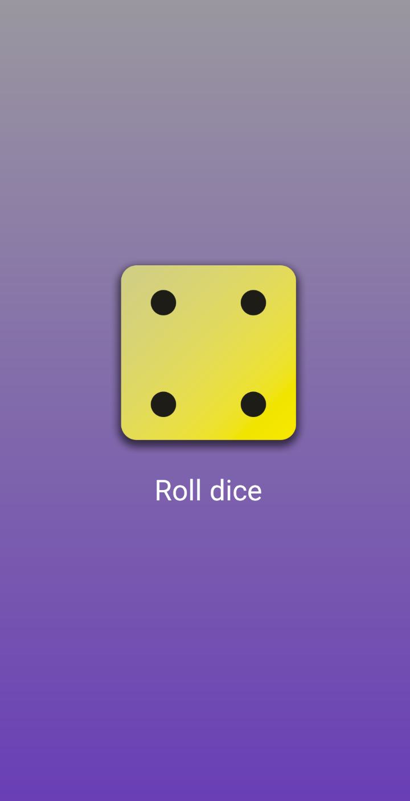
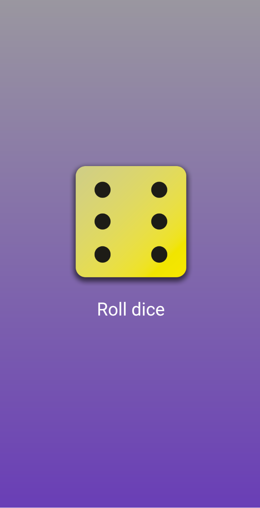

# dice_roller

A practice project in Flutter that implements a UI with a Dice image and a button allowing to do a dice roll. The image changes according to a random number from 1 to 6. No animation (yet?). 

## Screenshots

  
  

